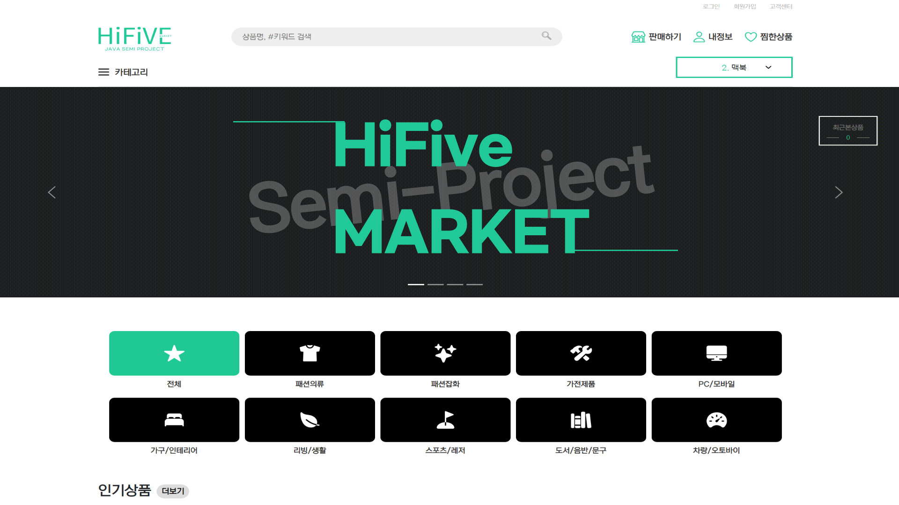

 
INDEX

 
- [INFORMATION](#information)
- [MAIN FUNCTION](#main-function)
- [SITE](#site)
- [STACKS](#stacks)
- [MEMBER](#member)

## INFORMATION

- #### 구디아카데미 세미 프로젝트
- #### 프로젝트 기간 : 2023-05-25 ~ 2023-06-29
- #### 참여 인원 : 5명
- #### 프로젝트 주제 : 사용자간 직접 거래를 할수 있는 중고 거래 사이트

 

## MAIN FUNCTION

- #### 중고 거래 상품 CRUD
- #### 마이페이지 거래 내역, 회원 정보 관리
- #### 고객센터 공지사항, 신고 기능
- #### 상품 카테고리별 조회
- #### 최근검색어, 실시간 인기 검색어

 

## SITE

### 배포 사이트 : [HiFive](http://14.36.141.71:10005/semi-hifive/index.jsp)

### 참고 사이트 : [번개장터](https://m.bunjang.co.kr/)

 

## STACKS

**Back-End**

 

 

**Front-End**

 
 

 

**API**

 

**Tools**

 

## MEMBER

### 🙎‍♂️ 최주영 - 팀장

#### ✅ 주요 기능 구현

- 중고상품 등록,수정
- 회원가입,로그인
- 관리자 페이지

### 🙎‍♂️ 김찬은

#### ✅ 주요 기능 구현

- 상품 카테고리
- 최근 본 상품

### 🙍‍♀️ 김현영

#### ✅ 주요 기능 구현

- 마이 페이지 쇼핑 정보
- 마이 페이지 내 정보 관리
- 메인 페이지

### 🙍‍♀️ 이은지

#### ✅ 주요 기능 구현

- 고객센터 공지사항, 자주하는 질문
- 고객센터 1:1문의
- 거래 내역, 판매글 신고

### 🙎‍♂️ 허성현

#### ✅ 주요 기능 구현

- 중고상품 상세페이지, 결제
- 회원 상점페이지
- 상품검색 최근 검색어, 실시간 검색어
